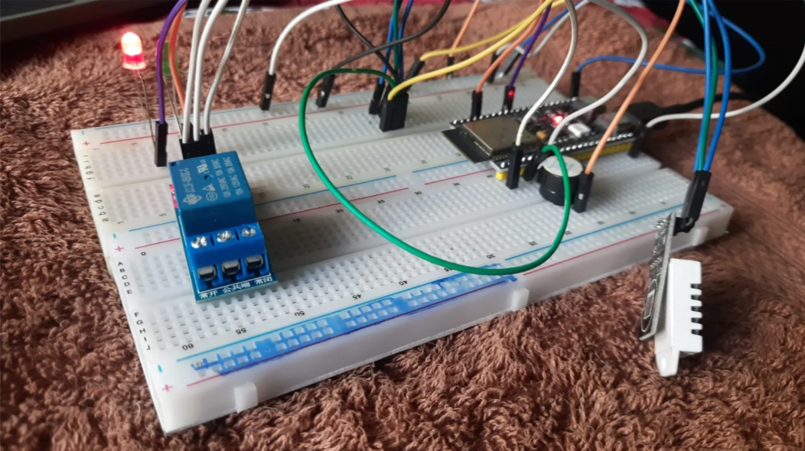
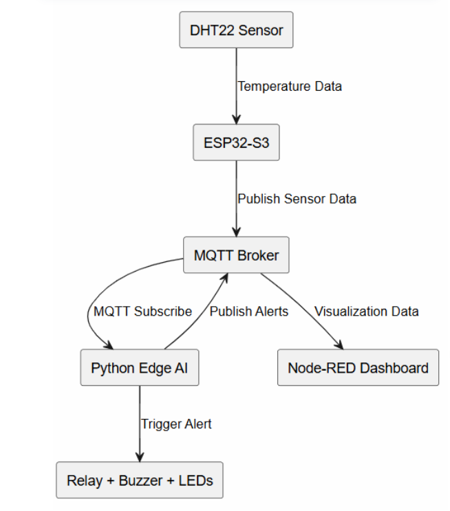
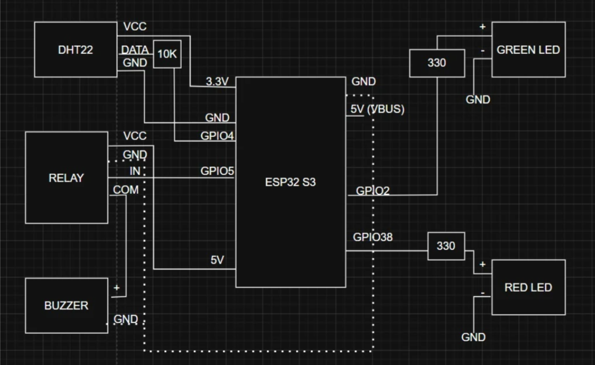

[comment]: # "Standard layout for CO326 - Project 18"

# **Room Temperature Anomaly Detection System**

---

## Team
-  e20024, [Ariyarathna D.B.S.] [email](mailto:e20024@eng.pdn.ac.lk)
-  e20346, Samarakoon S.M.P.H. [email](mailto:e20346@eng.pdn.ac.lk)
-  e20350, [Sandamali J.P.D.N.] [email](mailto:e20350@eng.pdn.ac.lk)
-  e20378, Siriwardane I.A.U. [email](mailto:e20378@eng.pdn.ac.lk)

#### Table of Contents
1. [Introduction](#introduction)
2. [Solution Architecture](#solution-architecture)
3. [Data Flow](#data-flow)
4. [Hardware & Software Designs](#hardware-and-software-designs)
5. [Edge AI Implementation](#edge-ai-implementation)
6. [Testing](#testing)
7. [Conclusion](#conclusion)
8. [Links](#links)

## Introduction
Uncontrolled temperature fluctuations in sensitive environments like server rooms, laboratories, or industrial units can lead to critical equipment failure and safety hazards. Manual monitoring is inefficient and lacks the real-time responsiveness needed for modern industrial standards.

This project introduces a high-reliability Edge AI system that monitors ambient temperature and humidity using an ESP32-S3 and DHT22 sensor. By processing data at the "Edge"—locally on a containerized Python node—the system identifies both immediate threshold violations and subtle statistical anomalies without relying on cloud connectivity, ensuring low latency and high availability.

## Solution Architecture
The system follows a layered Edge AI IoT architecture, moving data from physical sensors through a local message broker to a visualization and intelligence layer.The flow begins with the ESP32-S3 publishing JSON-formatted sensor data via the MQTT protocol. A Python-based Edge AI subscriber processes this data, while a Node-RED dashboard provides real-time visualization for the operator.

## Hardware and Software Designs
The hardware implementation utilizes an ESP32-S3 microcontroller, a DHT22 sensor, and a 5V relay module for physical alerts. On the software side, the entire infrastructure (MQTT Broker and Node-RED) is managed via Docker for seamless deployment.

### Circuit Diagram

## Edge AI Implementation
The core intelligence of the system utilizes a hybrid anomaly detection logic:
*   **Hard Threshold:** Monitors for static overheat or undercool triggers (e.g., > 32.0°C).
*   **Z-Score Analysis:** Uses a 20-sample rolling window to detect statistical outliers. This catches sudden spikes even if the temperature remains within "safe" threshold limits.

## Testing
We performed end-to-end integration testing using both physical hardware and a Python-based simulation script.
*   **Hardware Test:** Verified relay and buzzer activation by manually heating the DHT22 sensor.
*   **Simulation Test:** Used `simulate.py` to inject random anomaly spikes (5% probability) to verify the Z-score logic's accuracy.

| Test | Result |
| :--- | :--- |
| Sensor Accuracy | Pass (±0.5°C) |
| Edge AI Logic | Pass (Spikes detected) |
| Dashboard Update | Pass (< 2s latency) |

## Conclusion
What was achieved is a fully functional, containerized Edge AI solution that eliminates cloud dependency for industrial monitoring. Future developments include deploying the AI logic inside a standalone Docker container and integrating InfluxDB for long-term historical trend analysis.

## Links
- [Project Repository](https://github.com/cepdnaclk/e20-co326-Room-Temperature-Anomaly-Detection)
- [Department of Computer Engineering](http://www.ce.pdn.ac.lk/)
- [University of Peradeniya](https://eng.pdn.ac.lk/)

---
### Page Theme
This project uses a custom theme based on the University of Peradeniya's project theme. To modify, refer to the `_docs/_config.yml` file.
